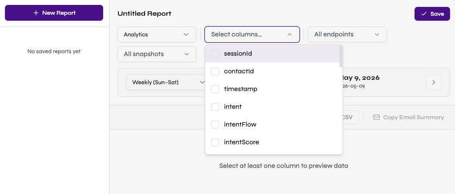
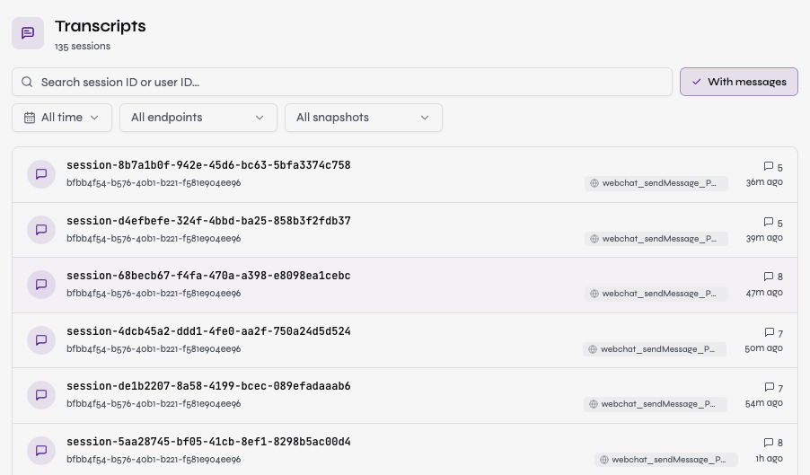
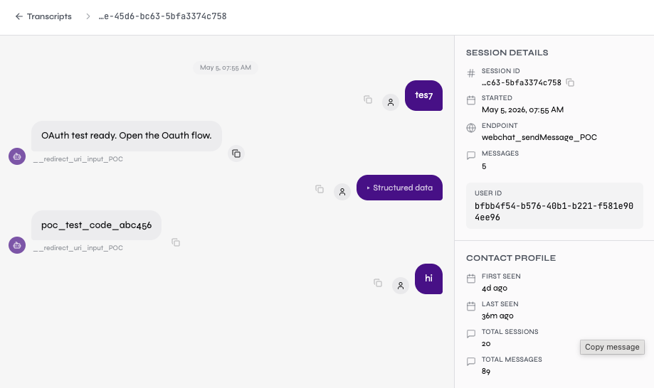

# Cognigy OData Suite

**[github.com/danieltucker/CognigyODataSuite](https://github.com/danieltucker/CognigyODataSuite)**

A local analytics tool for importing, exploring, and visualising data from Cognigy.AI OData feeds. Runs entirely on your machine — no cloud, no external services, no telemetry.


## What it does

Cognigy Insights has gaps in filtering, custom search, and data export. This tool pulls raw OData feeds from one or more Cognigy tenants into local DuckDB databases and gives you:

- **Import dashboard** — per-entity sync status, manual pull, and scheduled auto-sync
- **Data Explorer** — searchable, filterable, sortable tables for all 10 OData entities with CSV and Excel export
- **Analytics Dashboard** — session volume (area chart), unique users per day, top intents, channel distribution, execution time trends, NLU confidence, escalation rate, goals, top flows, LLM error detection, and agent evaluation — all filterable by date range, channel, endpoint, and snapshot
- **Transcript Explorer** — browse and search session transcripts with styled chat bubbles, inline conversation events (flow changes, escalations, goals), session metadata, user profile stats, and full user history across sessions
- **Reports** — freeform report builder with repeating time windows (weekly, monthly, custom), saved report configs, in-app data preview, and XLS/CSV export

Each customer's data is fully isolated in its own `.duckdb` file. Nothing ever leaves your machine except outbound OData API calls to the configured Cognigy endpoint.

## Prerequisites

- Node.js 22 or later
- npm

## Installation

```bash
git clone https://github.com/danieltucker/CognigyODataSuite.git
cd CognigyODataSuite
npm install
npm run dev
```

Open [http://localhost:3000](http://localhost:3000).

## Adding a customer

1. Click **Add Customer** in the sidebar
2. Enter a display name, your Cognigy OData URL (e.g. `https://odata-yourorg.cognigy.ai/v2.4`), and your API key
3. Click **Test Connection** to validate the credentials
4. Click **Save** — the database is created immediately

Each customer gets their own isolated database at `data/customers/{slug}/data.duckdb`.

## Importing data

From the customer overview page:

- **Pull** on any entity card to sync that entity only
- **Sync All** to run all 10 entities in sequence
- Imports run in the background; the UI polls for status automatically

Imports use timestamp-cursor pagination for incremental entities (avoiding high `$skip` offsets, which Cognigy flags as a performance concern). Three entities (`Steps`, `Goal Steps`, `Goal Step Metrics`) use full-refresh since they have no timestamp field.

**Initial sync limit**: the first sync for each incremental entity is capped to the past N days (default: 365) so that customers with years of historical data don't trigger an unbounded pull. This limit is configurable per customer via the "Historical data limit (days)" field in Add/Edit Customer. A manual full refresh bypasses the limit and fetches all available data.

Scheduled auto-sync runs on the interval configured per customer (default: every 4 hours). The scheduler starts automatically when the dev server starts via Next.js instrumentation.

## OData entities

| Entity | Sync mode |
|---|---|
| Analytics | Incremental (timestamp) |
| Conversations | Incremental (timestamp) |
| Executed Steps | Incremental (timestamp) |
| Sessions | Incremental (startedAt) |
| Live Agent Escalations | Incremental (timestamp) |
| Goals | Incremental (lastChanged) |
| Goal Events | Incremental (timestamp) |
| Steps | Full refresh |
| Goal Steps | Full refresh |
| Goal Step Metrics | Full refresh |

## Data Explorer

Navigate to any entity via **Records** in the sidebar. Features:

- Server-side pagination, sorting, and filtering (50 rows per page)
- Text search across key columns (session ID, contact ID, input text, intent, etc.)
- Date range filter on timestamp columns
- Column filters for **Channel**, **Endpoint Name**, and **Snapshot Name** where available
- Click any row to open a full record detail view showing every field
- Column visibility toggle — show/hide any column
- Export current filtered view to **CSV** or **Excel** (up to 50,000 rows)

## Dashboard

Click **Dashboard** in the sidebar sub-nav for any customer. Shows:

- KPI cards — total sessions, conversations, escalations (with rate), average intent score, total goal events, and conversations-per-session average
- Session volume by day (smooth area chart)
- Unique users per day (smooth area chart, alongside session volume)
- Top 10 intents
- Channel distribution
- Average execution time trend
- Intent score distribution (NLU confidence histogram)
- Top flows — most-executed flows from executed steps data (shown when data exists)
- Goals section — top goals by event count and goal events by day (shown when goal data exists)
- LLM error banner — warns when LLM provider errors are detected in conversation logs
- Agent Evaluation — surfaces simulator test pass/fail results with per-criterion breakdown (shown when simulator run data exists)

All charts re-query the local database when you change the date range (defaults to last 7 days), channel, endpoint, or snapshot filter. Endpoint and snapshot support multi-select.


## Reports

Click **Reports** in the sidebar sub-nav to open the report builder for any customer.

- **Saved reports** — left panel lists saved report configs; click any to load it; "New Report" to start fresh
- **Freeform builder** — choose an entity (Analytics, Sessions, Conversations, Goal Events, Executed Steps), select which columns to include, and apply endpoint/snapshot filters
- **Time window navigator** — define a window type (Weekly Sun–Sun, Weekly Mon–Mon, Monthly, or Custom N days), then navigate backward and forward through periods with prev/next arrows. The active window label shows the date range clearly. "Next" is disabled when the window would exceed today.
- **In-app preview** — live table shows up to 100 rows for the active window with a total row count
- **Export XLS / CSV** — exports the full filtered dataset (up to 50,000 rows) for the active window
- **Copy Email Summary** — copies a formatted HTML table to clipboard for quick pasting into emails



## Transcripts

Click **Transcripts** in the sidebar sub-nav to browse session transcripts for any customer. Features:

- Paginated session list showing session ID, user ID, endpoint, message count, and start time
- Escalated sessions highlighted with an orange icon
- Search by session ID or user ID; filter by date range (defaults to last 7 days), endpoint (multi-select), and snapshot (multi-select)
- "With messages" toggle to hide empty sessions by default
- Click any session to open the full chat transcript
  - User messages right-aligned (primary colour), bot messages left-aligned (muted), live agent messages in orange
  - Inline conversation events: flow changes (blue), handover requests (orange), goal completions (green)
  - Timestamps shown at 5-minute gaps; copy-to-clipboard button on every message
  - Session details panel: metadata, step count, escalations, rating and comment
  - User profile panel: first seen, last seen, total sessions, total messages, escalation count, average rating
  - User history panel: links to other sessions from the same user
  - On mobile: tab bar switches between Conversation and Details views
- Filter state is preserved in the URL — navigating into a transcript and pressing back restores your filters





## Tech stack

| Layer | Technology |
|---|---|
| Framework | Next.js 15 (App Router, TypeScript) |
| Database | DuckDB via `@duckdb/node-api` (one file per customer) |
| Charts | Recharts |
| UI | shadcn/ui + Tailwind CSS |
| HTTP | ky (OData fetching) |
| Scheduler | node-cron |
| Export | xlsx + papaparse |

## Project structure

```
src/
  app/
    api/customers/          REST API for customer management + import triggers
    customers/[slug]/       Per-customer pages (dashboard, records, data explorer)
  components/
    customers/              Entity cards, add/edit customer sheets
    dashboard/              Dashboard charts and KPI cards
    data/                   Data explorer table + record detail sheet
    transcripts/            Session list and transcript detail viewer
    layout/                 Sidebar
  db/
    client.ts               DuckDB connection manager (per-customer, cached)
    migrations/001_initial.sql  Full schema
    schema.ts               TypeScript interfaces + entity config
  lib/
    customers.ts            Customer registry (read/write customers.json)
    importer.ts             OData fetch + DuckDB upsert engine
    scheduler.ts            node-cron job management
    entity-columns.ts       Column definitions + default visibility per entity
    format-cell.ts          Cell value formatting (timestamps, JSON, booleans)
data/                       ← gitignored — never committed
  customers.json            Customer registry (includes API keys)
  customers/{slug}/
    data.duckdb             Per-customer DuckDB database
```

## Security

**This tool is designed for localhost use only.** It has no authentication. Any process on your machine that can make HTTP requests to `localhost:3000` can access all customer data and trigger OData syncs. Do not:
- Run it on a shared machine
- Expose the port via port-forwarding, reverse proxy, or ngrok
- Deploy it to a server without first adding authentication

Other security notes:

- `data/` is gitignored. API keys and all customer data stay on your machine and are never committed. Be aware that cloud sync services (OneDrive, Dropbox, iCloud) may back up the `data/` directory — consider excluding it from your sync client if API key confidentiality matters.
- API keys are stored in plaintext in `data/customers.json`. This is intentional for a local single-user tool. Do not deploy this to a shared server without adding authentication and encrypting credentials at rest.
- API keys are never returned by the REST API — GET responses redact the key and return `apiKeySet: true` instead.
- OData URLs must use HTTPS — the app rejects HTTP URLs on save.
- All database queries use parameterised statements. Table and column names in report queries are validated against a per-entity whitelist before interpolation.

## Environment

No environment variables are required. All configuration is stored in `data/customers.json` and managed through the UI.

## Building for production

```bash
npm run build
npm start
```
